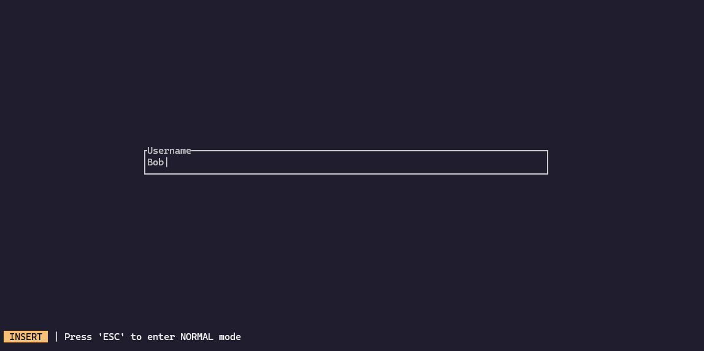

<br>
<br>

The Rust Unique Secure Talk is a secure chat application written in Rust

# Getting Started

## Installation

1. Clone the repository:

    ```bash
    git clone https://github.com/christiansassi/advanced-programming-of-cryptographic-methods-project
    ```

2. Make the `server.sh` and `tui.sh` scripts executable:

    ```bash
    chmod u+x server.sh tui.sh
    ```

## Configuration

You can modify the `config.toml` file located in the `config` directory to specify different application configurations:

- `server_ip`: The IP address of the server (default: `127.0.0.1`).
- `server_port`: The port of the server (default: `3333`).
- `log_level`: The logging level (default: `info`).

> [!WARNING]  
> Do not modify `private_key_server` and `public_key_server`, as these will be automatically generated when the server is started.

## Running the Application

### Server

Start the server by executing the [server.sh](server.sh) script from the root directory. You should see something like:


### Client

After the server is running, you can start the client by executing the [tui.sh](tui.sh) script from the root directory.

The client operates in two modes:

- **NORMAL**: Entered by pressing the `ESC` key. This mode allows interaction with the TUI. For a list of available key combinations, check the bottom of the TUI for instructions relevant to the current window.
  
- **INPUT**: Entered by pressing the `i` key. As the name suggests, this mode allows you to input text into the application’s input fields.

#### Registration

Before using the client, you need to register by choosing a unique username. The application does not support multiple users with the same username at the same time, and the username cannot be empty.



After registration, you will be taken to the main window, where you can add new friends to chat with by pressing the `a` key in the `NORMAL` mode


 see all active chats, along with the currently selected chat.


# Contacts

Matteo Bordignon - [matteo.bordignon@studenti.unitn.it](mailto:matteo.bordignon@studenti.unitn.it)

Alessandro Perez - [alessandro.perez@studenti.unitn.it](mailto:alessandro.perez@studenti.unitn.it)

Christian Sassi - [christian.sassi@studenti.unitn.it](mailto:christian.sassi@studenti.unitn.it)

<picture>
    <source media="(prefers-color-scheme: dark)" srcset="assets/extras/dark.png">
    
</picture>
