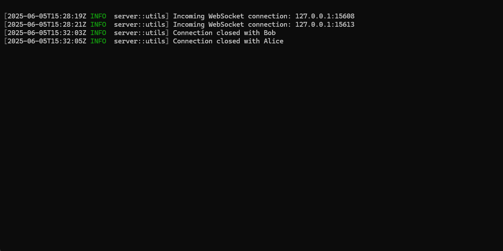

<br>

# Table of Contents

- [Introduction](#introduction)
- [Installation](#installation)
- [Configuration](#configuration)
- [Getting Started](#getting-started)
  - [Server](#server)
  - [Client](#client)
    - [Registration](#registration)
    - [Main Window](#main-window)
    - [Adding Friends](#adding-friends)
    - [Navigating Chats](#navigating-chats)
  - [Final Overview](#final-overview)
- [Resources](#resources)
- [Contacts](#contacts)

# Introduction

**T**he **R**ust **U**nique **S**ecure **T**alk (T.R.U.S.T.) is a secure chat application with a terminal user interface (TUI), developed in Rust. This project focuses on exploring secure communication principles and implementing a robust end-to-end encryption system for reliable and private messaging. <br>
The core of the project revolves around the **Extended Triple Diffie-Hellman** (**X3DH**) protocol for secure key establishment. Once a shared secret is established, the application switches to **AES-GCM** for symmetric message encryption. Together, these algorithms ensure end-to-end confidentiality and integrity of all communications.

# Installation

1. Clone the repository:

    ```bash
    git clone https://github.com/christiansassi/advanced-programming-of-cryptographic-methods-project
    ```

2. **Depending on your operating system:**

   - For **Unix-like systems** (e.g., *Linux*), use the provided bash scripts: [server.sh](server.sh) and [tui.sh](tui.sh).  
     Before running them, make sure they are executable by running:
     ```bash
     chmod u+x server.sh tui.sh
     ```

   - For **Windows systems**, use the provided bat scripts: [server.bat](server.bat) and [tui.bat](tui.bat).

> [!WARNING]  
> There were some issues building the releases for macOS. However, you can still run the project by using `cargo run` in the [`server`](server) and [`tui`](tui) directories.


# Configuration

You can modify the `config.toml` file located in the `config` directory to specify different application configurations:

- `server_ip`: The IP address of the server (default: `127.0.0.1`).
- `server_port`: The port of the server (default: `3333`).
- `log_level`: The logging level (default: `info`).

> [!WARNING]  
> Do not modify `private_key_server` and `public_key_server`, as these will be automatically generated when the server is started.

# Getting Started

### Server

Start the server by executing the `server.*` script from the root directory. You should see something like:



### Client

After the server is running, you can start the client by executing the `tui.*` script from the root directory.

The client operates in two modes:

- **NORMAL**: Entered by pressing the `ESC` key. This mode allows interaction with the TUI. For a list of available key combinations, check the bottom of the TUI for instructions relevant to the current window.
  
- **INPUT**: Entered by pressing the `i` key. As the name suggests, this mode allows you to input text into the application’s input fields.

#### Registration

Before using the client, you need to register by choosing a unique username. Usernames must be non-empty and unique—multiple users cannot share the same username simultaneously.


#### Main Window

After registration, you'll be taken to the main window. Initially, your chats list will be empty.


#### Adding Friends

To start chatting, you can add new friends at any time by pressing the `a` key in `NORMAL` mode.

> [!WARNING]  
> The person you want to chat with **must be online**.


#### Navigating Chats

While in `NORMAL` mode:
- Use the **left/right arrow keys** to switch between the chats list and the selected chat.
- In the chats list:
    - Use the **up/down arrow keys** to navigate through your chats.
    - Press `ENTER` to select a chat and start messaging.


### Final Overview

Here's an overview of the server and clients in action (with two clients for demonstration purposes):


# Resources

[Report](report/report.pdf)

# Contacts

Matteo Bordignon -- [matteo.bordignon@studenti.unitn.it](mailto:matteo.bordignon@studenti.unitn.it)

Alessandro Perez -- [alessandro.perez@studenti.unitn.it](mailto:alessandro.perez@studenti.unitn.it)

Christian Sassi -- [christian.sassi@studenti.unitn.it](mailto:christian.sassi@studenti.unitn.it)

<picture>
    <source media="(prefers-color-scheme: dark)" srcset="assets/extras/dark.png">
    
</picture>
